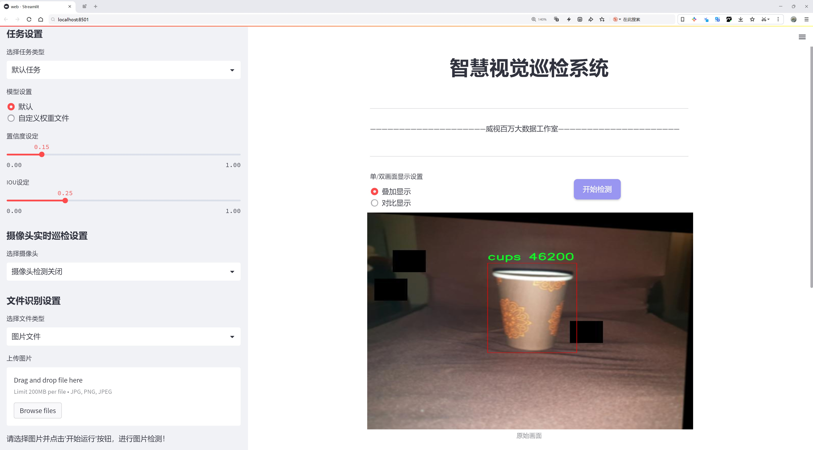

# 餐饮场景检测系统源码分享
 # [一条龙教学YOLOV8标注好的数据集一键训练_70+全套改进创新点发刊_Web前端展示]

### 1.研究背景与意义

项目参考[AAAI Association for the Advancement of Artificial Intelligence](https://gitee.com/qunmasj/projects)

研究背景与意义

随着社会经济的快速发展和人们生活水平的不断提高，餐饮行业正经历着前所未有的变革。消费者对餐饮服务的需求不仅限于食物的口味和品质，更加注重用餐环境、服务效率以及个性化体验。在这样的背景下，如何提升餐饮场景的智能化管理水平，成为了行业内亟待解决的重要课题。基于计算机视觉的餐饮场景检测系统，尤其是利用深度学习技术进行物体检测，能够有效提升餐饮服务的智能化水平，优化顾客体验，降低运营成本。

YOLO（You Only Look Once）系列模型因其高效的实时检测能力和较高的准确率，已成为物体检测领域的热门选择。YOLOv8作为该系列的最新版本，具备了更强的特征提取能力和更快的推理速度，适合应用于复杂的餐饮场景中。然而，尽管YOLOv8在物体检测方面表现出色，但在特定场景下的应用仍存在一定的局限性，尤其是在多类物体同时出现的情况下，检测精度和效率仍有待提升。因此，基于改进YOLOv8的餐饮场景检测系统的研究，具有重要的理论和实践意义。

本研究所使用的数据集包含9284张图像，涵盖50个类别，包括火、刀具、各类食物（如牛肉薄片、凯撒沙拉、炸薯条等）以及人群等。这些类别的多样性不仅反映了餐饮场景的复杂性，也为模型的训练和测试提供了丰富的样本。通过对这些数据的深入分析和处理，可以有效提升模型对餐饮场景中不同物体的识别能力，进而实现对餐饮环境的全面监控和智能管理。

此外，改进YOLOv8的研究还将为餐饮行业的智能化转型提供技术支持。通过实现对餐饮场景中各类物体的精准检测，餐饮企业可以更好地掌握顾客需求，优化菜品配置和服务流程。例如，实时监测顾客的用餐状态和需求变化，能够帮助服务人员及时提供服务，提高顾客满意度。同时，系统还可以通过数据分析，识别出高频出现的菜品和顾客偏好，为餐饮企业的菜单设计和营销策略提供数据支持。

总之，基于改进YOLOv8的餐饮场景检测系统的研究，不仅能够推动计算机视觉技术在餐饮行业的应用，还能为行业的智能化发展提供新的思路和解决方案。通过提升餐饮场景的智能化管理水平，最终实现提高服务质量、降低运营成本和增强顾客体验的目标，为餐饮行业的可持续发展贡献力量。

### 2.图片演示




##### 注意：由于此博客编辑较早，上面“2.图片演示”和“3.视频演示”展示的系统图片或者视频可能为老版本，新版本在老版本的基础上升级如下：（实际效果以升级的新版本为准）

  （1）适配了YOLOV8的“目标检测”模型和“实例分割”模型，通过加载相应的权重（.pt）文件即可自适应加载模型。

  （2）支持“图片识别”、“视频识别”、“摄像头实时识别”三种识别模式。

  （3）支持“图片识别”、“视频识别”、“摄像头实时识别”三种识别结果保存导出，解决手动导出（容易卡顿出现爆内存）存在的问题，识别完自动保存结果并导出到。

  （4）支持Web前端系统中的标题、背景图等自定义修改，后面提供修改教程。

  另外本项目提供训练的数据集和训练教程,暂不提供权重文件（best.pt）,需要您按照教程进行训练后实现图片演示和Web前端界面演示的效果。

### 3.视频演示

[3.1 视频演示](https://www.ixigua.com/7406243080967291428?logTag=a62c247d0dd8878dbebd)

### 4.数据集信息展示

数据集信息展示

在现代计算机视觉领域，餐饮场景的检测与识别已成为一个重要的研究方向。为了提升YOLOv8模型在这一领域的性能，我们构建了一个名为“FinalData”的数据集，该数据集专门用于训练和改进餐饮场景检测系统。该数据集包含9284张高质量的图像，涵盖了50个不同的类别，旨在为模型提供丰富的视觉信息和多样化的场景背景。

“FinalData”数据集的类别列表极为丰富，涵盖了从食品到餐具的多种元素。具体而言，数据集中包括了如“火”、“刀具”、“人”等基础类别，这些类别对于识别餐饮场景中的关键要素至关重要。此外，数据集中还包含了多种具体的食品类别，如“牛肉薄片”、“甜菜沙拉”、“早餐卷饼”、“凯撒沙拉”、“卡普雷塞沙拉”、“鸡肉卷饼”、“鸡翅”、“蛤蜊浓汤”、“俱乐部三明治”等。这些类别不仅展示了不同类型的美食，还反映了多样化的饮食文化，适应了不同地域和饮食习惯的需求。

数据集中的图像经过精心挑选，确保了其在光照、角度和背景等方面的多样性，以增强模型的泛化能力。例如，包含“炸薯条”、“法式吐司”、“炒饭”、“意大利饺子”、“希腊沙拉”等食品的图像，展现了不同的烹饪风格和呈现方式，能够帮助模型更好地理解和识别不同餐饮场景中的食物特征。此外，数据集中还包括了如“冰淇淋”、“汉堡”、“热狗”、“鹰嘴豆泥”、“煎蛋卷”等受欢迎的快餐食品，这些都是在日常生活中常见的餐饮选择。

值得注意的是，数据集还涵盖了一些餐饮场景中常见的配件和器具，如“杯子”、“纸盒”、“洋葱圈”、“煎饼”等，这些元素的存在使得模型在检测时能够更全面地理解餐饮环境。通过对这些细节的捕捉，模型将能够更准确地识别出场景中的各个组成部分，从而提升整体的检测效果。

“FinalData”数据集的构建遵循了开放数据的原则，采用了CC BY 4.0许可证，允许研究人员和开发者在遵循相应条款的基础上自由使用和分享该数据集。这一举措不仅促进了学术界和工业界的合作，也为进一步的研究提供了宝贵的资源。

综上所述，“FinalData”数据集以其丰富的图像数量和多样的类别设置，为YOLOv8模型的训练提供了坚实的基础。通过对餐饮场景的全面覆盖，该数据集不仅能够帮助模型提高识别精度，还能够推动餐饮行业在智能化、自动化方面的发展。未来，我们期待该数据集能够在更广泛的应用场景中发挥作用，为餐饮行业的数字化转型贡献力量。


### 5.全套项目环境部署视频教程（零基础手把手教学）

[5.1 环境部署教程链接（零基础手把手教学）](https://www.ixigua.com/7404473917358506534?logTag=c807d0cbc21c0ef59de5)


[5.2 安装Python虚拟环境创建和依赖库安装视频教程链接（零基础手把手教学）](https://www.ixigua.com/7404474678003106304?logTag=1f1041108cd1f708b01a)

### 6.手把手YOLOV8训练视频教程（零基础小白有手就能学会）

[6.1 环境部署教程链接（零基础手把手教学）](https://www.ixigua.com/7404477157818401292?logTag=d31a2dfd1983c9668658)

### 7.70+种全套YOLOV8创新点代码加载调参视频教程（一键加载写好的改进模型的配置文件）

[7.1 环境部署教程链接（零基础手把手教学）](https://www.ixigua.com/7404478314661806627?logTag=29066f8288e3f4eea3a4)

### 8.70+种全套YOLOV8创新点原理讲解（非科班也可以轻松写刊发刊，V10版本正在科研待更新）

由于篇幅限制，每个创新点的具体原理讲解就不一一展开，具体见下列网址中的创新点对应子项目的技术原理博客网址【Blog】：


[8.1 70+种全套YOLOV8创新点原理讲解链接](https://gitee.com/qunmasj/good)

### 9.系统功能展示（检测对象为举例，实际内容以本项目数据集为准）

图1.系统支持检测结果表格显示

  图2.系统支持置信度和IOU阈值手动调节

  图3.系统支持自定义加载权重文件best.pt(需要你通过步骤5中训练获得)

  图4.系统支持摄像头实时识别

  图5.系统支持图片识别

  图6.系统支持视频识别

  图7.系统支持识别结果文件自动保存

  图8.系统支持Excel导出检测结果数据


### 10.原始YOLOV8算法原理

原始YOLOv8算法原理

YOLOv8算法是目标检测领域的最新突破，其设计理念和实现方式在前几代YOLO模型的基础上进行了深度优化，展现出更高的检测精度和效率。该算法的架构主要由输入层、主干网络、颈部网络和头部网络四个核心组件构成，形成了一个完整的目标检测流程。

在输入层，YOLOv8首先对输入图像进行缩放，以适应模型所需的特定输入尺寸。这一过程不仅确保了输入数据的一致性，还为后续的特征提取奠定了基础。接下来，主干网络的作用便是通过一系列卷积操作对图像进行下采样，从而提取出有用的特征信息。与以往的YOLO版本相比，YOLOv8在卷积层中引入了批归一化和SiLUR激活函数，这一改进不仅加速了训练过程，还有效提升了模型的非线性表达能力。

主干网络的设计中，YOLOv8采用了C2f块，这一模块借鉴了YOLOv7中的E-ELAN结构，通过跨层分支连接来增强模型的梯度流动性。这种设计使得特征的提取更加高效，尤其是在处理复杂场景时，能够显著改善检测结果。主干网络的末尾，YOLOv8引入了SPPFl块，通过三个最大池化层对多尺度特征进行处理，进一步增强了网络的特征抽象能力。这一过程使得模型能够更好地捕捉到不同尺度下的目标信息，从而提高了检测的准确性。

在特征融合阶段，YOLOv8采用了颈部网络，该网络结合了特征金字塔网络（FPN）和路径聚合网络（PAN）的结构。这一组合不仅能够有效融合不同尺度的特征图信息，还能将这些信息传递给后续的头部网络，确保模型在进行目标检测时能够充分利用多层次的特征信息。通过这种方式，YOLOv8能够在复杂的背景中准确定位目标，并提高对小目标的检测能力。

头部网络是YOLOv8的最后一环，其采用了解耦的检测头设计。与传统的耦合头不同，YOLOv8通过两个并行的卷积分支分别计算回归和类别的损失。这种解耦设计使得模型在进行目标检测时能够更加专注于每个任务，从而提高了检测的精度和效率。此外，YOLOv8还引入了新的损失策略，通过变焦损失计算分类损失，并使用数据平均保真度损失和完美交并比损失来计算边界框损失。这一创新使得YOLOv8在处理目标检测任务时，能够更加准确地评估模型的性能，进一步提升了检测效果。

YOLOv8的轻量化版本，即YOLOv8n，专注于降低模型的复杂度，特别是在骨干特征提取网络层中，使用了更轻量的C2F模块替代原有的C3模块，并将卷积操作简化为3×3的形式。这一改进使得YOLOv8n在保持检测精度的同时，显著提高了模型的运行速度和资源利用效率。特征融合层的优化也使得YOLOv8n能够更快地提取不同尺度的特征信息，进一步增强了模型的实用性。

总的来说，YOLOv8算法通过一系列的结构优化和创新设计，不仅提升了目标检测的准确性和效率，还为实际应用提供了更为灵活和高效的解决方案。其在处理复杂场景和小目标时的优越表现，使得YOLOv8成为当前目标检测领域中最具竞争力的算法之一。随着技术的不断进步，YOLOv8的应用前景将更加广阔，未来有望在更多实际场景中发挥重要作用。


### 11.项目核心源码讲解（再也不用担心看不懂代码逻辑）

#### 11.1 train.py

以下是对给定代码的核心部分进行提炼和详细注释的版本：

```python
import os
import torch
import yaml
from ultralytics import YOLO  # 导入YOLO模型
from QtFusion.path import abs_path  # 导入获取绝对路径的函数

# 设置设备为GPU（如果可用），否则使用CPU
device = "0" if torch.cuda.is_available() else "cpu"

if __name__ == '__main__':  # 确保该模块被直接运行时才执行以下代码
    workers = 1  # 设置数据加载的工作进程数
    batch = 2    # 设置每个批次的大小

    data_name = "data"  # 数据集名称
    # 获取数据集配置文件的绝对路径
    data_path = abs_path(f'datasets/{data_name}/{data_name}.yaml', path_type='current')
    unix_style_path = data_path.replace(os.sep, '/')  # 将路径转换为Unix风格

    # 获取数据集目录路径
    directory_path = os.path.dirname(unix_style_path)

    # 读取YAML配置文件，保持原有顺序
    with open(data_path, 'r') as file:
        data = yaml.load(file, Loader=yaml.FullLoader)

    # 修改YAML文件中的路径项
    if 'path' in data:
        data['path'] = directory_path  # 更新路径为数据集目录
        # 将修改后的数据写回YAML文件
        with open(data_path, 'w') as file:
            yaml.safe_dump(data, file, sort_keys=False)

    # 加载预训练的YOLOv8模型
    model = YOLO(model='./ultralytics/cfg/models/v8/yolov8s.yaml', task='detect')

    # 开始训练模型
    results2 = model.train(
        data=data_path,  # 指定训练数据的配置文件路径
        device=device,  # 使用之前设置的设备
        workers=workers,  # 使用指定的工作进程数
        imgsz=640,  # 指定输入图像的大小为640x640
        epochs=100,  # 指定训练100个epoch
        batch=batch,  # 指定每个批次的大小
        name='train_v8_' + data_name  # 指定训练任务的名称
    )
```

### 代码核心部分及注释说明：

1. **导入必要的库**：
   - `os`：用于处理文件和目录路径。
   - `torch`：PyTorch库，用于深度学习模型的训练和推理。
   - `yaml`：用于读取和写入YAML格式的配置文件。
   - `YOLO`：从`ultralytics`库中导入YOLO模型，便于进行目标检测。

2. **设备选择**：
   - 根据是否有可用的GPU，选择相应的计算设备（GPU或CPU）。

3. **主程序入口**：
   - 确保只有在直接运行该脚本时才执行以下代码。

4. **数据集配置**：
   - 设置数据集名称，并获取对应的YAML配置文件的绝对路径。
   - 将路径转换为Unix风格，以确保跨平台兼容性。

5. **读取和修改YAML文件**：
   - 读取YAML文件内容，并检查是否包含`path`项，如果有，则更新为数据集的目录路径，并将修改后的内容写回文件。

6. **模型加载与训练**：
   - 加载预训练的YOLOv8模型。
   - 使用指定的参数开始训练模型，包括数据路径、设备、工作进程数、图像大小、训练轮数和批次大小。

通过以上注释，代码的核心逻辑和功能得以清晰展现，便于理解和后续的修改或扩展。

这个 `train.py` 文件是一个用于训练 YOLOv8 模型的 Python 脚本。首先，脚本导入了必要的库，包括 `os`、`torch`、`yaml` 和 `ultralytics` 中的 YOLO 模型。接着，脚本通过检查 CUDA 是否可用来决定使用 GPU 还是 CPU 进行训练。

在 `__main__` 块中，首先定义了一些训练参数，包括工作进程数和批次大小。接下来，指定了数据集的名称为 "data"，并构建了该数据集 YAML 文件的绝对路径。通过 `abs_path` 函数获取该路径后，脚本将路径中的分隔符替换为 Unix 风格的分隔符，以确保在不同操作系统上的兼容性。

然后，脚本获取了数据集目录的路径，并打开 YAML 文件以读取其内容。使用 `yaml` 库读取 YAML 文件后，脚本检查是否存在 `path` 项，如果存在，则将其修改为数据集的目录路径，并将修改后的内容写回到 YAML 文件中。这一步确保了数据集路径的正确性。

接下来，脚本加载了预训练的 YOLOv8 模型，指定了模型的配置文件路径。之后，调用 `model.train()` 方法开始训练模型。在训练过程中，指定了训练数据的配置文件路径、设备（CPU 或 GPU）、工作进程数、输入图像的大小（640x640）、训练的 epoch 数（100）以及每个批次的大小（2）。最后，训练任务的名称也被指定为 `train_v8_` 加上数据集的名称。

总的来说，这个脚本实现了从数据集路径的处理到模型训练的完整流程，适用于使用 YOLOv8 进行目标检测任务的训练。

#### 11.2 ui.py

```python
import sys
import subprocess

def run_script(script_path):
    """
    使用当前 Python 环境运行指定的脚本。

    Args:
        script_path (str): 要运行的脚本路径

    Returns:
        None
    """
    # 获取当前 Python 解释器的路径
    python_path = sys.executable

    # 构建运行命令
    command = f'"{python_path}" -m streamlit run "{script_path}"'

    # 执行命令
    result = subprocess.run(command, shell=True)
    if result.returncode != 0:
        print("脚本运行出错。")


# 实例化并运行应用
if __name__ == "__main__":
    # 指定您的脚本路径
    script_path = "web.py"  # 这里可以直接指定脚本路径

    # 运行脚本
    run_script(script_path)
```

### 代码核心部分注释

1. **导入模块**：
   - `import sys`: 导入 `sys` 模块，用于访问与 Python 解释器相关的变量和函数。
   - `import subprocess`: 导入 `subprocess` 模块，用于创建新进程、连接到它们的输入/输出/错误管道，并获取返回码。

2. **定义 `run_script` 函数**：
   - `def run_script(script_path)`: 定义一个函数，接受一个参数 `script_path`，表示要运行的脚本的路径。
   - `python_path = sys.executable`: 获取当前 Python 解释器的路径，以便在命令中使用。
   - `command = f'"{python_path}" -m streamlit run "{script_path}"'`: 构建要执行的命令，使用 `streamlit` 模块运行指定的脚本。
   - `result = subprocess.run(command, shell=True)`: 使用 `subprocess.run` 执行构建的命令，并等待命令完成。
   - `if result.returncode != 0`: 检查命令的返回码，如果不为 0，表示执行出错，打印错误信息。

3. **主程序入口**：
   - `if __name__ == "__main__":`: 确保只有在直接运行该脚本时才会执行以下代码。
   - `script_path = "web.py"`: 指定要运行的脚本路径。
   - `run_script(script_path)`: 调用 `run_script` 函数，运行指定的脚本。

这个程序文件名为 `ui.py`，主要功能是通过当前的 Python 环境运行一个指定的脚本。程序首先导入了必要的模块，包括 `sys`、`os` 和 `subprocess`，以及一个自定义的路径处理模块 `abs_path`。

在程序中定义了一个名为 `run_script` 的函数，该函数接受一个参数 `script_path`，表示要运行的脚本的路径。函数内部首先获取当前 Python 解释器的路径，使用 `sys.executable` 来实现。接着，构建一个命令字符串，命令的格式是通过 Python 解释器运行 `streamlit` 模块，并指定要运行的脚本。

然后，使用 `subprocess.run` 方法执行构建好的命令。该方法会在一个新的 shell 中运行命令，并等待其完成。如果脚本运行的返回码不为零，表示运行过程中出现了错误，程序会打印出“脚本运行出错”的提示信息。

在文件的最后部分，使用 `if __name__ == "__main__":` 语句来确保只有在直接运行该文件时才会执行后面的代码。此时，指定了要运行的脚本路径为 `web.py`，并调用 `run_script` 函数来执行这个脚本。

总体来说，这个程序的主要目的是提供一个简单的接口来运行 `web.py` 脚本，并处理可能出现的错误。

#### 11.3 ultralytics\utils\callbacks\tensorboard.py

以下是代码中最核心的部分，并附上详细的中文注释：

```python
# 导入必要的库
from ultralytics.utils import LOGGER, SETTINGS, TESTS_RUNNING, colorstr

try:
    # 尝试导入TensorBoard的SummaryWriter，用于记录训练过程中的数据
    from torch.utils.tensorboard import SummaryWriter

    # 确保当前不是在运行测试
    assert not TESTS_RUNNING  
    # 确保TensorBoard集成已启用
    assert SETTINGS["tensorboard"] is True  
    WRITER = None  # 初始化TensorBoard的SummaryWriter实例

except (ImportError, AssertionError, TypeError, AttributeError):
    # 处理导入错误或断言错误
    SummaryWriter = None  # 如果导入失败，则将SummaryWriter设置为None


def _log_scalars(scalars, step=0):
    """将标量值记录到TensorBoard中。"""
    if WRITER:  # 如果WRITER存在
        for k, v in scalars.items():  # 遍历标量字典
            WRITER.add_scalar(k, v, step)  # 记录标量值


def _log_tensorboard_graph(trainer):
    """将模型图记录到TensorBoard中。"""
    try:
        import warnings
        from ultralytics.utils.torch_utils import de_parallel, torch

        imgsz = trainer.args.imgsz  # 获取输入图像的大小
        imgsz = (imgsz, imgsz) if isinstance(imgsz, int) else imgsz  # 确保图像大小是一个元组
        p = next(trainer.model.parameters())  # 获取模型参数以确定设备和类型
        im = torch.zeros((1, 3, *imgsz), device=p.device, dtype=p.dtype)  # 创建一个零输入图像
        with warnings.catch_warnings():
            warnings.simplefilter("ignore", category=UserWarning)  # 忽略JIT跟踪警告
            WRITER.add_graph(torch.jit.trace(de_parallel(trainer.model), im, strict=False), [])  # 记录模型图
    except Exception as e:
        LOGGER.warning(f"WARNING ⚠️ TensorBoard图形可视化失败 {e}")  # 记录警告信息


def on_pretrain_routine_start(trainer):
    """使用SummaryWriter初始化TensorBoard日志记录。"""
    if SummaryWriter:  # 如果SummaryWriter可用
        try:
            global WRITER
            WRITER = SummaryWriter(str(trainer.save_dir))  # 创建SummaryWriter实例
            prefix = colorstr("TensorBoard: ")
            LOGGER.info(f"{prefix}使用 'tensorboard --logdir {trainer.save_dir}' 启动，查看地址为 http://localhost:6006/")
        except Exception as e:
            LOGGER.warning(f"WARNING ⚠️ TensorBoard未正确初始化，未记录此次运行。 {e}")  # 记录警告信息


def on_train_start(trainer):
    """记录TensorBoard图形。"""
    if WRITER:  # 如果WRITER存在
        _log_tensorboard_graph(trainer)  # 记录模型图


def on_train_epoch_end(trainer):
    """在训练周期结束时记录标量统计信息。"""
    _log_scalars(trainer.label_loss_items(trainer.tloss, prefix="train"), trainer.epoch + 1)  # 记录训练损失
    _log_scalars(trainer.lr, trainer.epoch + 1)  # 记录学习率


def on_fit_epoch_end(trainer):
    """在训练周期结束时记录周期指标。"""
    _log_scalars(trainer.metrics, trainer.epoch + 1)  # 记录训练指标


# 定义回调函数，根据SummaryWriter是否可用来选择性地添加回调
callbacks = (
    {
        "on_pretrain_routine_start": on_pretrain_routine_start,
        "on_train_start": on_train_start,
        "on_fit_epoch_end": on_fit_epoch_end,
        "on_train_epoch_end": on_train_epoch_end,
    }
    if SummaryWriter  # 如果SummaryWriter可用
    else {}
)
```

### 代码核心部分解释：
1. **导入和初始化**：首先导入必要的库，尝试初始化TensorBoard的`SummaryWriter`，并确保在非测试模式下运行。
2. **记录标量**：`_log_scalars`函数用于将训练过程中的标量数据（如损失和学习率）记录到TensorBoard。
3. **记录模型图**：`_log_tensorboard_graph`函数用于记录模型的计算图，以便在TensorBoard中可视化模型结构。
4. **回调函数**：定义了一系列回调函数，在训练的不同阶段（如开始训练、结束训练周期等）调用相应的记录函数。
5. **条件回调**：根据`SummaryWriter`的可用性，选择性地注册回调函数，以确保只有在TensorBoard可用时才进行日志记录。

这个程序文件是用于在Ultralytics YOLO框架中集成TensorBoard的回调函数，主要用于记录训练过程中的各种信息，以便后续可视化和分析。文件的主要功能是通过TensorBoard记录标量值、模型图等信息。

首先，文件导入了一些必要的模块，包括Ultralytics的日志记录器和设置。它尝试从`torch.utils.tensorboard`导入`SummaryWriter`，这是TensorBoard的核心类，用于记录和管理日志。如果导入失败，或者在测试运行时，或者设置中未启用TensorBoard集成，则会捕获异常并将`SummaryWriter`设置为`None`。

接下来，定义了几个私有函数。`_log_scalars`函数用于将标量值记录到TensorBoard中，它接收一个字典类型的参数`scalars`和一个步数`step`，遍历字典并将每个标量值添加到TensorBoard中。`_log_tensorboard_graph`函数用于记录模型的计算图，它首先获取输入图像的大小，然后创建一个全零的张量作为输入，使用`torch.jit.trace`来跟踪模型的计算图，并将其添加到TensorBoard中。如果过程中出现任何异常，则会记录警告信息。

文件中还定义了一些回调函数，这些函数会在训练的不同阶段被调用。`on_pretrain_routine_start`函数在预训练例程开始时被调用，初始化TensorBoard的记录器，并输出如何启动TensorBoard的提示信息。`on_train_start`函数在训练开始时被调用，负责记录模型的计算图。`on_train_epoch_end`函数在每个训练周期结束时被调用，记录训练损失和学习率等标量统计信息。`on_fit_epoch_end`函数在训练周期结束时被调用，记录训练的指标。

最后，文件定义了一个`callbacks`字典，包含了上述回调函数的映射关系，如果`SummaryWriter`可用，则将这些回调函数添加到字典中；否则，字典为空。这使得在训练过程中可以根据需要调用相应的回调函数来记录信息。

总的来说，这个文件的目的是通过TensorBoard记录训练过程中的重要信息，以便用户能够更好地监控和分析模型的训练效果。

#### 11.4 ultralytics\models\nas\predict.py

以下是代码中最核心的部分，并附上详细的中文注释：

```python
import torch
from ultralytics.engine.predictor import BasePredictor
from ultralytics.engine.results import Results
from ultralytics.utils import ops

class NASPredictor(BasePredictor):
    """
    Ultralytics YOLO NAS 预测器，用于目标检测。

    该类扩展了 Ultralytics 引擎中的 `BasePredictor`，负责对 YOLO NAS 模型生成的原始预测结果进行后处理。
    它应用了非极大值抑制（NMS）和将边界框缩放到原始图像尺寸等操作。

    属性:
        args (Namespace): 包含各种后处理配置的命名空间。
    """

    def postprocess(self, preds_in, img, orig_imgs):
        """对预测结果进行后处理，并返回结果对象的列表。"""

        # 将预测框从xyxy格式转换为xywh格式，并获取类别分数
        boxes = ops.xyxy2xywh(preds_in[0][0])  # 获取边界框
        preds = torch.cat((boxes, preds_in[0][1]), -1).permute(0, 2, 1)  # 合并边界框和分数，并调整维度

        # 应用非极大值抑制（NMS）以消除冗余的边界框
        preds = ops.non_max_suppression(
            preds,
            self.args.conf,  # 置信度阈值
            self.args.iou,   # IOU阈值
            agnostic=self.args.agnostic_nms,  # 是否进行类别无关的NMS
            max_det=self.args.max_det,  # 最大检测数量
            classes=self.args.classes,   # 需要检测的类别
        )

        # 如果输入图像不是列表，则将其转换为numpy数组
        if not isinstance(orig_imgs, list):  # 输入图像是torch.Tensor而不是列表
            orig_imgs = ops.convert_torch2numpy_batch(orig_imgs)  # 转换为numpy格式

        results = []  # 存储结果的列表
        for i, pred in enumerate(preds):  # 遍历每个预测结果
            orig_img = orig_imgs[i]  # 获取原始图像
            # 将边界框缩放到原始图像的尺寸
            pred[:, :4] = ops.scale_boxes(img.shape[2:], pred[:, :4], orig_img.shape)
            img_path = self.batch[0][i]  # 获取图像路径
            # 创建结果对象并添加到结果列表中
            results.append(Results(orig_img, path=img_path, names=self.model.names, boxes=pred))
        return results  # 返回结果列表
```

### 代码核心部分说明：
1. **导入必要的库**：导入 PyTorch 和 Ultralytics 中的相关模块。
2. **NASPredictor 类**：继承自 `BasePredictor`，负责处理 YOLO NAS 模型的预测结果。
3. **postprocess 方法**：主要的后处理逻辑，包括：
   - 将预测框格式转换。
   - 应用非极大值抑制（NMS）以减少冗余框。
   - 将边界框缩放到原始图像尺寸。
   - 返回包含结果的列表。

这个程序文件 `ultralytics\models\nas\predict.py` 定义了一个名为 `NASPredictor` 的类，主要用于对 YOLO NAS 模型生成的原始预测结果进行后处理，以实现目标检测功能。该类继承自 `BasePredictor`，并包含了一些重要的属性和方法。

在类的文档字符串中，说明了 `NASPredictor` 的功能，它负责对 YOLO NAS 模型的原始预测结果进行后处理，包括应用非极大值抑制（NMS）和将边界框缩放到原始图像的尺寸。类中有一个属性 `args`，它是一个命名空间，包含了各种后处理的配置参数。

`postprocess` 方法是 `NASPredictor` 的核心功能。它接收三个参数：`preds_in`（原始预测结果）、`img`（输入图像）和 `orig_imgs`（原始图像）。在方法内部，首先通过调用 `ops.xyxy2xywh` 将预测框的坐标格式从 (x1, y1, x2, y2) 转换为 (x_center, y_center, width, height)。接着，将边界框和类分数进行拼接，并进行维度调整。

随后，使用 `ops.non_max_suppression` 方法对拼接后的预测结果进行非极大值抑制，以去除冗余的边界框。这个过程涉及到一些参数，如置信度阈值、IOU 阈值、是否进行类别无关的 NMS、最大检测数量和特定类别等。

接下来，方法检查 `orig_imgs` 是否为列表，如果不是，则将其转换为 NumPy 数组。然后，方法遍历每个预测结果，并根据原始图像的尺寸对边界框进行缩放。最后，将每个预测结果封装成 `Results` 对象，并返回一个结果列表。

总体来说，这个文件实现了 YOLO NAS 模型的后处理功能，确保生成的预测结果可以有效地反映在原始图像上，并提供了便于使用的接口。

#### 11.5 ultralytics\trackers\utils\matching.py

以下是经过简化和注释的核心代码部分：

```python
import numpy as np
import scipy
from scipy.spatial.distance import cdist
from ultralytics.utils.metrics import bbox_ioa

try:
    import lap  # 尝试导入线性分配库
    assert lap.__version__  # 验证库的版本
except (ImportError, AssertionError, AttributeError):
    from ultralytics.utils.checks import check_requirements
    check_requirements("lapx>=0.5.2")  # 检查并安装lap库
    import lap

def linear_assignment(cost_matrix: np.ndarray, thresh: float, use_lap: bool = True) -> tuple:
    """
    使用线性分配算法进行匹配。

    参数:
        cost_matrix (np.ndarray): 成本矩阵，包含分配的成本值。
        thresh (float): 认为分配有效的阈值。
        use_lap (bool, optional): 是否使用lap库进行分配。默认为True。

    返回:
        tuple: 包含匹配的索引、未匹配的索引（来自'a'和'b'）。
    """
    if cost_matrix.size == 0:
        # 如果成本矩阵为空，返回空匹配和所有未匹配索引
        return np.empty((0, 2), dtype=int), tuple(range(cost_matrix.shape[0])), tuple(range(cost_matrix.shape[1]))

    if use_lap:
        # 使用lap库进行线性分配
        _, x, y = lap.lapjv(cost_matrix, extend_cost=True, cost_limit=thresh)
        matches = [[ix, mx] for ix, mx in enumerate(x) if mx >= 0]  # 匹配的索引
        unmatched_a = np.where(x < 0)[0]  # 未匹配的'a'索引
        unmatched_b = np.where(y < 0)[0]  # 未匹配的'b'索引
    else:
        # 使用scipy库进行线性分配
        x, y = scipy.optimize.linear_sum_assignment(cost_matrix)  # 获取匹配的行和列索引
        matches = np.asarray([[x[i], y[i]] for i in range(len(x)) if cost_matrix[x[i], y[i]] <= thresh])
        if len(matches) == 0:
            unmatched_a = list(np.arange(cost_matrix.shape[0]))
            unmatched_b = list(np.arange(cost_matrix.shape[1]))
        else:
            unmatched_a = list(set(np.arange(cost_matrix.shape[0])) - set(matches[:, 0]))
            unmatched_b = list(set(np.arange(cost_matrix.shape[1])) - set(matches[:, 1]))

    return matches, unmatched_a, unmatched_b  # 返回匹配和未匹配的索引

def iou_distance(atracks: list, btracks: list) -> np.ndarray:
    """
    计算基于交并比（IoU）的成本矩阵。

    参数:
        atracks (list): 轨迹'a'或边界框的列表。
        btracks (list): 轨迹'b'或边界框的列表。

    返回:
        np.ndarray: 基于IoU计算的成本矩阵。
    """
    # 确保输入是边界框格式
    atlbrs = [track.tlbr for track in atracks] if not isinstance(atracks[0], np.ndarray) else atracks
    btlbrs = [track.tlbr for track in btracks] if not isinstance(btracks[0], np.ndarray) else btracks

    ious = np.zeros((len(atlbrs), len(btlbrs)), dtype=np.float32)  # 初始化IoU矩阵
    if len(atlbrs) and len(btlbrs):
        # 计算IoU
        ious = bbox_ioa(
            np.ascontiguousarray(atlbrs, dtype=np.float32), np.ascontiguousarray(btlbrs, dtype=np.float32), iou=True
        )
    return 1 - ious  # 返回成本矩阵

def embedding_distance(tracks: list, detections: list, metric: str = "cosine") -> np.ndarray:
    """
    计算轨迹和检测之间的嵌入距离。

    参数:
        tracks (list): 轨迹列表。
        detections (list): 检测列表。
        metric (str, optional): 距离计算的度量方式。默认为'cosine'。

    返回:
        np.ndarray: 基于嵌入计算的成本矩阵。
    """
    cost_matrix = np.zeros((len(tracks), len(detections)), dtype=np.float32)  # 初始化成本矩阵
    if cost_matrix.size == 0:
        return cost_matrix
    det_features = np.asarray([track.curr_feat for track in detections], dtype=np.float32)  # 检测特征
    track_features = np.asarray([track.smooth_feat for track in tracks], dtype=np.float32)  # 轨迹特征
    cost_matrix = np.maximum(0.0, cdist(track_features, det_features, metric))  # 计算距离
    return cost_matrix  # 返回成本矩阵

def fuse_score(cost_matrix: np.ndarray, detections: list) -> np.ndarray:
    """
    将成本矩阵与检测分数融合，生成相似度矩阵。

    参数:
        cost_matrix (np.ndarray): 成本矩阵。
        detections (list): 带有分数的检测列表。

    返回:
        np.ndarray: 融合后的相似度矩阵。
    """
    if cost_matrix.size == 0:
        return cost_matrix
    iou_sim = 1 - cost_matrix  # 将成本矩阵转换为相似度
    det_scores = np.array([det.score for det in detections])  # 获取检测分数
    det_scores = np.expand_dims(det_scores, axis=0).repeat(cost_matrix.shape[0], axis=0)  # 扩展分数维度
    fuse_sim = iou_sim * det_scores  # 融合相似度
    return 1 - fuse_sim  # 返回融合后的成本矩阵
```

### 代码说明：
1. **linear_assignment**: 该函数用于根据给定的成本矩阵执行线性分配，返回匹配的索引和未匹配的索引。
2. **iou_distance**: 计算两个轨迹或边界框之间的交并比（IoU），并返回成本矩阵。
3. **embedding_distance**: 计算轨迹和检测之间的嵌入距离，返回成本矩阵。
4. **fuse_score**: 将成本矩阵与检测分数结合，生成一个相似度矩阵。

这个程序文件 `ultralytics/trackers/utils/matching.py` 主要用于实现目标跟踪中的匹配算法，特别是基于成本矩阵的线性分配和相似度计算。程序中使用了 NumPy 和 SciPy 库来处理数组和计算距离，同时也依赖于 LAP（线性分配问题的解决库）来优化匹配过程。

首先，程序导入了必要的库，包括 NumPy 和 SciPy 的空间距离计算模块。接着，尝试导入 LAP 库，如果未能成功导入，则会检查并要求安装一个名为 `lapx` 的库，这是 LAP 的一个更新版本。

在 `linear_assignment` 函数中，程序实现了线性分配算法。该函数接受一个成本矩阵和一个阈值，返回匹配的索引以及未匹配的索引。首先检查成本矩阵是否为空，如果为空，则返回空的匹配结果和所有未匹配的索引。如果使用 LAP 库，则调用 `lap.lapjv` 函数进行匹配；如果不使用 LAP，则使用 SciPy 的 `linear_sum_assignment` 函数。最终，函数返回匹配的结果和未匹配的索引。

接下来的 `iou_distance` 函数计算基于交并比（IoU）的成本矩阵。它接受两个轨迹列表，检查输入是否为 NumPy 数组，如果不是，则提取每个轨迹的边界框（tlbr）。然后，使用 `bbox_ioa` 函数计算 IoU，并返回成本矩阵（1 - IoU）。

`embedding_distance` 函数计算轨迹和检测之间的嵌入距离。它接受轨迹和检测列表，使用给定的距离度量（默认为余弦距离）计算成本矩阵。首先创建一个空的成本矩阵，然后提取检测的特征，最后计算轨迹特征与检测特征之间的距离。

最后，`fuse_score` 函数将成本矩阵与检测分数融合，生成一个单一的相似度矩阵。它首先计算 IoU 相似度，然后将检测分数扩展到与成本矩阵相同的形状，最后通过相乘的方式融合相似度和分数，返回最终的融合成本。

总体而言，这个文件提供了一系列函数，用于在目标跟踪中进行有效的匹配和相似度计算，利用了不同的距离度量和优化算法来提高匹配的准确性和效率。

#### 11.6 ultralytics\models\sam\modules\tiny_encoder.py

以下是提取出的核心代码部分，并附上详细的中文注释：

```python
import torch
import torch.nn as nn
import torch.nn.functional as F

class Conv2d_BN(torch.nn.Sequential):
    """一个顺序容器，执行2D卷积，后接批量归一化。"""

    def __init__(self, in_channels, out_channels, kernel_size=1, stride=1, padding=0, dilation=1, groups=1, bn_weight_init=1):
        """初始化卷积层和批量归一化层。"""
        super().__init__()
        # 添加卷积层
        self.add_module("conv", torch.nn.Conv2d(in_channels, out_channels, kernel_size, stride, padding, dilation, groups, bias=False))
        # 添加批量归一化层
        bn = torch.nn.BatchNorm2d(out_channels)
        # 初始化批量归一化的权重和偏置
        torch.nn.init.constant_(bn.weight, bn_weight_init)
        torch.nn.init.constant_(bn.bias, 0)
        self.add_module("bn", bn)

class PatchEmbed(nn.Module):
    """将图像嵌入为补丁，并将其投影到指定的嵌入维度。"""

    def __init__(self, in_chans, embed_dim, resolution, activation):
        """初始化PatchEmbed类。"""
        super().__init__()
        img_size = (resolution, resolution)  # 假设输入图像为正方形
        self.patches_resolution = (img_size[0] // 4, img_size[1] // 4)  # 每个补丁的分辨率
        self.in_chans = in_chans
        self.embed_dim = embed_dim
        n = embed_dim
        # 定义卷积层序列
        self.seq = nn.Sequential(
            Conv2d_BN(in_chans, n // 2, 3, 2, 1),  # 第一个卷积层
            activation(),  # 激活函数
            Conv2d_BN(n // 2, n, 3, 2, 1),  # 第二个卷积层
        )

    def forward(self, x):
        """将输入张量通过PatchEmbed模型的操作序列。"""
        return self.seq(x)

class TinyViT(nn.Module):
    """TinyViT架构，用于视觉任务。"""

    def __init__(self, img_size=224, in_chans=3, num_classes=1000, embed_dims=[96, 192, 384, 768], depths=[2, 2, 6, 2], num_heads=[3, 6, 12, 24], window_sizes=[7, 7, 14, 7], mlp_ratio=4.0, drop_rate=0.0, drop_path_rate=0.1, use_checkpoint=False):
        """初始化TinyViT模型。"""
        super().__init__()
        self.img_size = img_size
        self.num_classes = num_classes
        self.depths = depths
        self.num_layers = len(depths)
        self.mlp_ratio = mlp_ratio

        activation = nn.GELU  # 使用GELU激活函数

        # 初始化补丁嵌入层
        self.patch_embed = PatchEmbed(in_chans=in_chans, embed_dim=embed_dims[0], resolution=img_size, activation=activation)

        # 构建模型的各层
        self.layers = nn.ModuleList()
        for i_layer in range(self.num_layers):
            layer = BasicLayer(
                dim=embed_dims[i_layer],
                input_resolution=(self.img_size // (2 ** i_layer), self.img_size // (2 ** i_layer)),
                depth=depths[i_layer],
                num_heads=num_heads[i_layer],
                window_size=window_sizes[i_layer],
                mlp_ratio=self.mlp_ratio,
                drop=drop_rate,
                use_checkpoint=use_checkpoint,
            )
            self.layers.append(layer)

        # 分类头
        self.head = nn.Linear(embed_dims[-1], num_classes) if num_classes > 0 else nn.Identity()

    def forward(self, x):
        """执行输入张量的前向传播。"""
        x = self.patch_embed(x)  # 通过补丁嵌入层
        for layer in self.layers:
            x = layer(x)  # 通过每一层
        return self.head(x)  # 通过分类头
```

### 代码说明：
1. **Conv2d_BN**: 这个类实现了一个包含卷积层和批量归一化层的组合，通常用于图像处理任务中。
2. **PatchEmbed**: 该类将输入图像分割成小补丁，并将其嵌入到指定的维度，通常用于视觉Transformer模型中。
3. **TinyViT**: 这是一个小型视觉Transformer架构的实现，包含多个层和一个分类头，用于处理图像分类任务。它使用了补丁嵌入、多个基本层和最终的线性分类层。

这个程序文件实现了一个名为TinyViT的视觉模型架构，主要用于图像处理任务。TinyViT结合了卷积神经网络（CNN）和自注意力机制，借鉴了LeViT和Swin Transformer的设计思想。文件中定义了多个类，每个类负责模型的不同部分，以下是对这些类及其功能的详细说明。

首先，文件导入了必要的库，包括PyTorch的核心模块和一些实用工具。接着，定义了多个模块化的类，构成了TinyViT模型的基础。

`Conv2d_BN`类是一个简单的卷积层，后接批量归一化。它通过构造函数初始化卷积层和批量归一化层，并对批量归一化的权重和偏置进行初始化。

`PatchEmbed`类负责将输入图像分割成小块（patches），并将这些小块映射到指定的嵌入维度。它使用了两个卷积层来实现这一功能，并在前向传播中将输入张量通过这些卷积层。

`MBConv`类实现了Mobile Inverted Bottleneck卷积层，主要用于高效的特征提取。它包含三个卷积操作，分别用于扩展、深度卷积和压缩特征通道，并在每个卷积后应用激活函数。

`PatchMerging`类则用于合并相邻的特征块，并将其投影到新的维度。它通过一系列卷积操作实现这一功能，并在前向传播中处理输入张量。

`ConvLayer`类是一个卷积层的容器，包含多个MBConv层，并可选择性地对输出进行下采样。它支持梯度检查点，以节省内存。

`Mlp`类实现了多层感知机（MLP），用于在Transformer架构中进行特征转换。它包含两个全连接层和层归一化操作。

`Attention`类实现了多头自注意力机制，支持空间感知。它通过查询、键和值的线性变换计算注意力权重，并应用可训练的注意力偏置。

`TinyViTBlock`类结合了自注意力和局部卷积，构成TinyViT的基本模块。它在前向传播中应用注意力机制和局部卷积，并将结果与输入进行残差连接。

`BasicLayer`类是TinyViT的基本层，包含多个TinyViTBlock。它负责构建模型的每一层，并在必要时进行下采样。

`LayerNorm2d`类实现了二维层归一化，主要用于归一化卷积层的输出。

最后，`TinyViT`类是整个模型的核心，负责初始化模型的各个部分，包括输入图像的嵌入、多个层的堆叠以及分类头。它支持多种配置参数，如图像大小、输入通道数、类别数、嵌入维度、层深度等。模型的前向传播通过`forward`方法实现，首先通过嵌入层处理输入，然后依次通过各个层，最后返回分类结果。

整体来看，这个文件实现了一个灵活且高效的视觉模型TinyViT，适用于各种图像处理任务，结合了现代深度学习中的多种技术。

### 12.系统整体结构（节选）

### 整体功能和构架概括

该项目是一个基于Ultralytics YOLO框架的深度学习目标检测和图像处理系统。其主要功能包括模型训练、预测、回调处理、目标跟踪、特征匹配以及模型架构的定义。整体架构采用模块化设计，各个文件负责不同的功能，便于维护和扩展。

- **训练模块**：负责模型的训练过程，包括数据加载、模型配置和训练参数设置。
- **用户界面模块**：提供一个简单的接口来运行特定的脚本，便于用户交互。
- **回调模块**：集成TensorBoard以记录训练过程中的各种指标，便于可视化和分析。
- **预测模块**：处理模型的预测结果，包括后处理和边界框的缩放。
- **匹配模块**：实现目标跟踪中的匹配算法，计算相似度和成本矩阵。
- **模型架构模块**：定义TinyViT模型，结合卷积和自注意力机制，用于高效的特征提取。

### 文件功能整理表

| 文件路径                                             | 功能描述                                                   |
|-----------------------------------------------------|-----------------------------------------------------------|
| `train.py`                                         | 负责YOLOv8模型的训练，包括数据集处理和训练参数设置。   |
| `ui.py`                                           | 提供一个接口来运行指定的脚本（如`web.py`），处理用户交互。 |
| `ultralytics/utils/callbacks/tensorboard.py`     | 集成TensorBoard，记录训练过程中的标量和模型图信息。     |
| `ultralytics/models/nas/predict.py`               | 处理YOLO NAS模型的预测结果，包括后处理和边界框缩放。     |
| `ultralytics/trackers/utils/matching.py`          | 实现目标跟踪中的匹配算法，计算相似度和成本矩阵。         |
| `ultralytics/models/sam/modules/tiny_encoder.py`  | 定义TinyViT模型架构，结合卷积和自注意力机制进行特征提取。 |
| `ultralytics/utils/tuner.py`                       | 提供模型超参数调优的功能，优化模型性能。                 |
| `ultralytics/models/rtdetr/val.py`                 | 负责RT-DETR模型的验证过程，评估模型性能。                 |
| `ultralytics/models/utils/__init__.py`            | 初始化模型工具模块，提供通用的模型工具函数。             |
| `ultralytics/models/yolo/segment/train.py`        | 负责YOLO分割模型的训练过程，包括数据处理和训练配置。     |

这个表格概述了项目中各个文件的主要功能，展示了项目的模块化结构和各部分之间的协作关系。

注意：由于此博客编辑较早，上面“11.项目核心源码讲解（再也不用担心看不懂代码逻辑）”中部分代码可能会优化升级，仅供参考学习，完整“训练源码”、“Web前端界面”和“70+种创新点源码”以“13.完整训练+Web前端界面+70+种创新点源码、数据集获取”的内容为准。

### 13.完整训练+Web前端界面+70+种创新点源码、数据集获取


#完整训练+Web前端界面+70+种创新点源码、数据集获取链接
https://mbd.pub/o/bread/ZpqUk51y

